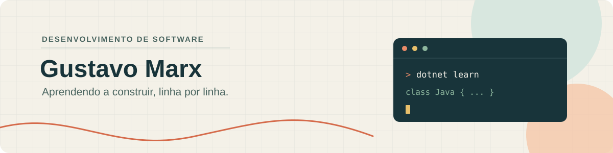

  

<h1 align="center">Gustavo Marx Santos Albano</h1>

Estudante de Sistemas de Informação

Por aqui, vou compartilhar projetos que desenvolvi durante meus estudos. Tenho interesse em desenvolvimento de software, segurança e cloud. Atualmente, estou direcionando meus estudos para o desenvolvimento back-end com **.NET** e **Java**.

Também tenho experiência como estagiário de RPA, utilizando o **UiPath** para desenvolver automações.

- **Certificação:** Microsoft Azure Fundamentals (AZ-900)
- **LinkedIn:** [Gustavo Marx Albano](https://www.linkedin.com/in/gustavomarxalb/)
